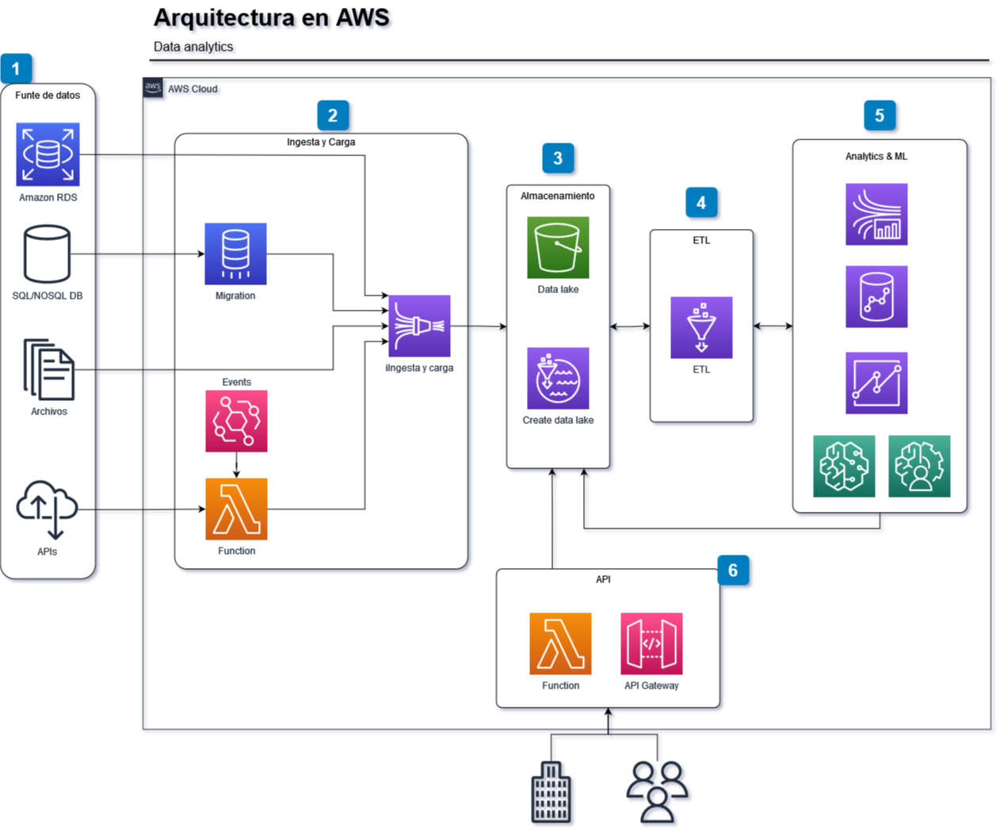

# indigitall-contaminacion
Para la prueba de acceso ([acceso al pdf](prueba_indigitall.pdf)) a Indigitall se plantean 2 objetivos:

## Objetivo 1
Lectura y tratamiento de los datos: esto se ha realizado en el notebook [01-prueba_indigitall.ipynb](01-prueba_indigitall.ipynb) en el cual lo que se pretende es dejar un set de datos limpios y ordenados de cara a que otro departamento o persona pueda utilizarlos y acceder a ellos de manera más directa. 

Como resultado de este tratamiento se ha dejado en [un solo archivo csv](madrid_contaminacion_2018.csv) todas las mediciones tomadas en la comunidad de madrid en el año 2018 y se ha elegido una jerarquía de los datos H01...H24 en una sola columna y ordenados por estación, mes, día y hora. Las columnas restantes (provincia, municipio y punto de muestreo) se han eliminado ya que no aportan información adicional a los datos.

De esta manera se pueden filtrar y analizar facilmente todas las mediciones tomadas depediendo de la necesidad, como por ejemplo: media diaria de una estación en un mes concreto, en un día concreto, media de madrid en un mes o día, hacer una media por cada hora para ver a qué horas hay un pico de conaminación, etc. 

## Objetivo 2
Para el objetivo 2 se propone una arquitectura basada en la nube utilizando recursos sin servidor de AWS ya que simplifica el mantenimiento y la escalabilidad de los mismos. 

1. Sin presuponer nada, se ofrece en la arquitectura varias opciones de fuentes de datos. 
    1.1. Amazon RDS: bbdd SQL ya alojada en AWS
    1.2. BBDD propia para lo cual se necesitaría el servicio de migración de bbdd de [Amazon AWS Database Migration Service](https://aws.amazon.com/es/dms/).
    1.3. Archivos descargados de la [web del Ayto. de Madrid](https://datos.madrid.es/portal/site/egob/menuitem.c05c1f754a33a9fbe4b2e4b284f1a5a0/?vgnextoid=41e01e007c9db410VgnVCM2000000c205a0aRCRD&vgnextchannel=374512b9ace9f310VgnVCM100000171f5a0aRCRD&vgnextfmt=default) con las mediciones en tiempo real de la contaminación atmosférica.
    1.4. API externa con mediciones de temperatura en tiempo real para lo cual se necesita un generador de eventos de [EventBridge](https://aws.amazon.com/es/eventbridge/) que ejecute una [Función Lambda](https://aws.amazon.com/es/lambda/) que haga peticiones recurrentes a la API meteorológica.
2. [Amazon Kinesis](https://aws.amazon.com/es/kinesis/data-firehose/) se encarga de cargar los datos provenientes de diferentes fuentes a un Data Lake
3. Para el almacenamiento se utilizan [AWS LAke Formation](https://aws.amazon.com/es/lake-formation/?whats-new-cards.sort-by=item.additionalFields.postDateTime&whats-new-cards.sort-order=desc) para la creación de un data Lake en [AWS S3](https://aws.amazon.com/es/s3/)
4. Para la transformación de datos se puede utilizar [AWS Glue](https://aws.amazon.com/es/glue/?whats-new-cards.sort-by=item.additionalFields.postDateTime&whats-new-cards.sort-order=desc) ya que ofrece varias herramientas para leer, enriquecer, limpiar, normalizar datos. Adicionalmente ofrece tambien otros recursos compatibles que faciliten a otros equipos alimentar consumir el Data Lake.
5. Para el análisis de los datos y la generación de algoritmos de ML e IA existen varias opciones a valorar con el resto del equipo experto en ello. Se proponen varios recursos que ofrece AWS para ello como pueden ser: 
    5.1. [Amazon Kinesis Data Analytics](https://aws.amazon.com/es/kinesis/data-analytics/)
    5.2. [Amazon Redshift](https://aws.amazon.com/es/redshift/)
    5.3. [Amazon QuickSight](https://aws.amazon.com/es/quicksight/)
    5.4. [Amazon SageMaker](https://aws.amazon.com/es/sagemaker/) y [AWS AI services](https://aws.amazon.com/es/machine-learning/ai-services/)
6. Por último para el consumo de estos datos ya analizados se provee de una API mediante Lambdas y [API Gateway](https://aws.amazon.com/es/api-gateway/)

Esta arquitectura es una propuesta en función de las características que se han pedido para esta prueba intentando conservar un balance entre la calidad de lo aquí expuesto y el tiempo del que se dispuesto para ello.
